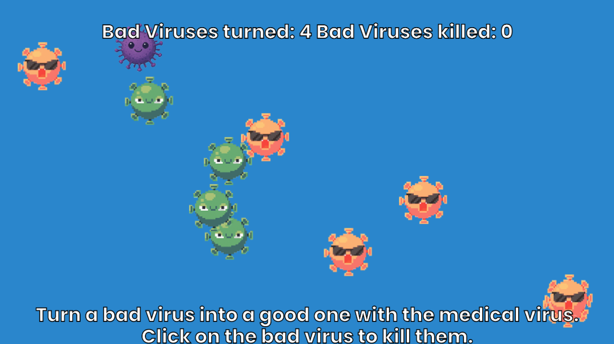

# Stop the virus from spreading!

**Versie 1**

Genereer 30 virussen in het scherm. 
Maak de virussen 'onschadelijk' door op een virus te klikken met de muis. 
Wanneer je klikt wordt het virus verwijderd. 

**Versie 2**

Genereer 29 'goede' virussen en 1 'slecht' virus.
Wanneer een slecht virus een goed virus aanraakt, dan zal het goede virus in een slecht virus veranderen. 
Porbeer zo snel mogelijk de slechte virussen te verwijderen door deze aan te klikken. 


## Clone project

- Klik op use this template > Create a new repository
- Ga naar het project toe in je eigen github pagina.
- Klik op Code en kopieer de .git url.
- Open Visual Studio Code, klik op Files > Clone repository
- Het project wordt nu gedownload naar je eigen projectmap

## install

```bash
npm install 
npm run dev
```